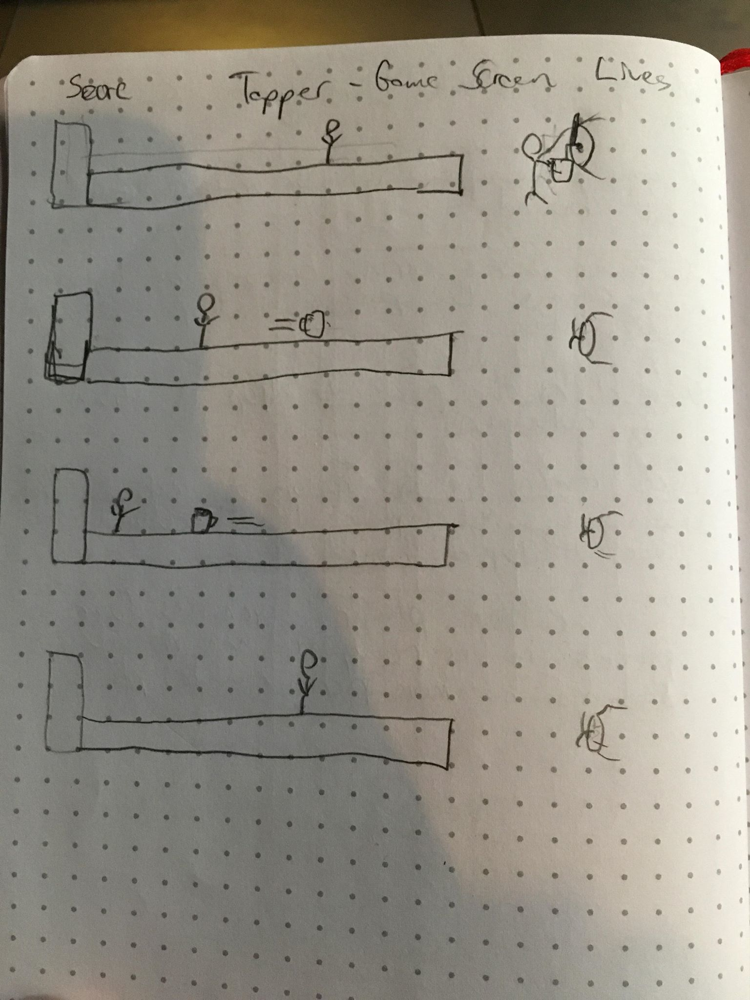

What this is: 
	
	Hamm's Tosser is a game based on the classsic Bally Arcade cabinet, "Tapper"
	The game runs using the HTML canvas element and animation frames
	
	The game can run in any web browser as long as it's big enough to hold the canvas element = 800px by 800px
		the game can be run on other systems if the screen size can be altered

	It is web browser based and should be able to run on any system assuming a screen size that fits the canvas the game runs in

Hamm's Tosser User Stories :

	Start Screen loads for the player
	User hits start and game begins

	Player can move from bar to bar with W + S keys
	
	Player can serve beer by tapping space bar
		If patron is there to catch sliding beer, player gains points
		If no patron is there to catch beer, player loses life

	If customer makes it to end of bar, player loses life

Win conditions :

	Player 1 scores more points than Player 2 or vice versa
	Both players have completed an equal number of rounds.

Features to add Later:

	Draft beer - space bar keyup to pass beer after certain time of keydown
	Different types of patrons - images, need multiple beers to be served, throw empties back to bartender
	Retrieving Empties - patrons throw empty beers back to bartender that need to be retrieved

